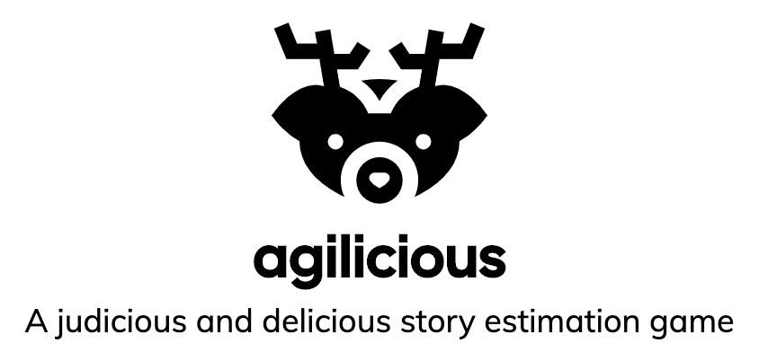
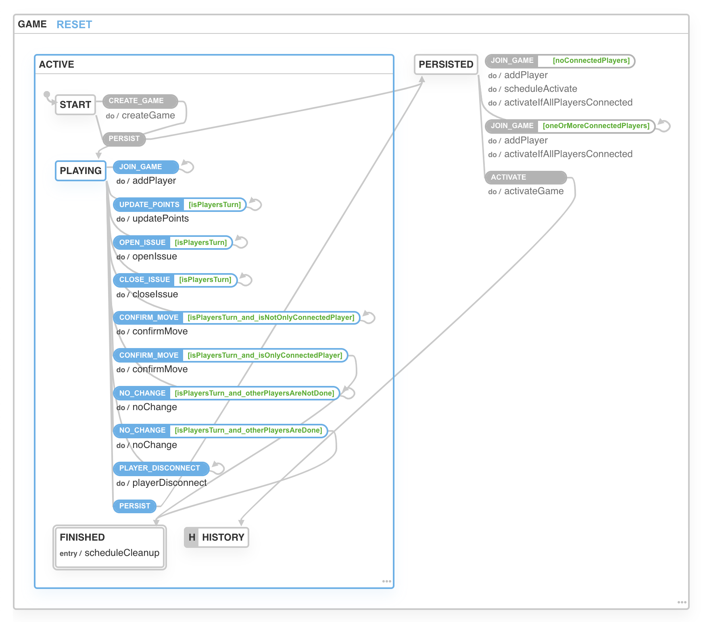

  

# Agilicious Server

This is the server component of Agilicious.

Agilicious is a game made by Jim Redfern (server) and Tom Stapleton (client) during the Tradeshift Global Hackathon 2020.

We created this game to let our engineering teams play online the estimation game that we used to play in the office at Tradeshift, before the shelter-in-place laws came into effect in San Francisco.

Play it here: http://agilicio.us

---

## Usage

### To start the development server:

First open a terminal and launch the Postgresql docker instance:

`cd docker` 
`./start-db.sh`

Next open a second terminal and run the database migration:

`npm run db:migrate`

Finally run the node server:

`npm run dev`

---

### To start the production server:

`npm run compile` 
`npm run start`

The server is configured to run on heroku with a postgres database dyno. There's a "postinstall" npm script picked up by heroku which starts the server.

### Environment variables

DATABASE_URL is expected to contain the database connection string, and NODE_ENV should contain "production" (or at least a string that is not "development").

---

### To run the test suite:

`npm run test`

---

## State Machine

Agilicious Server was created using the xstate state machine, which provides a super cool interactive visualization of the game's state machine:

https://xstate.js.org/viz/?gist=c1c2f08e252ea15a88576ef7a36b29fa

  

---

## License

MIT © [Jim Redfern](). Avatar icons licenced from flaticon.com.

[npm-image]: https://badge.fury.io/js/button-clicker.svg
[npm-url]: https://npmjs.org/package/button-clicker
[travis-image]: https://travis-ci.com/jmredfern/button-clicker.svg?branch=master
[travis-url]: https://travis-ci.com/jmredfern/button-clicker
[daviddm-image]: https://david-dm.org/jmredfern/button-clicker.svg?theme=shields.io
[daviddm-url]: https://david-dm.org/jmredfern/button-clicker
[coveralls-image]: https://coveralls.io/repos/jmredfern/button-clicker/badge.svg
[coveralls-url]: https://coveralls.io/r/jmredfern/button-clicker
